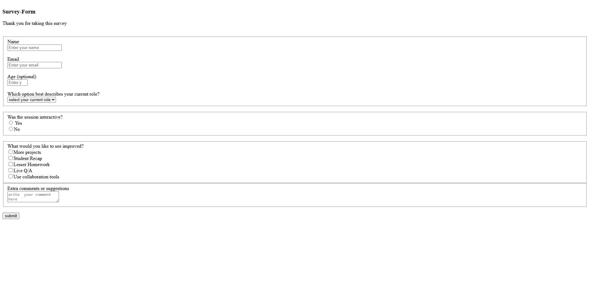

# 📝 Project 4 - Survey Form
[live@](bibinsurveyform.netlify.app)

This project is a simple **Survey Form webpage** built using basic HTML.  
It allows users to fill out a short feedback form including their name, email, role, session interactivity feedback, improvement suggestions, and additional comments.

---

## 📖 Table of Contents
- [Overview](#overview)
- [Features](#features)
- [Technologies Used](#technologies-used)
- [Project Structure](#project-structure)
- [Setup Instructions](#setup-instructions)
- [Usage](#usage)
- [Form Fields](#form-fields)
- [Future Enhancements](#future-enhancements)
- [Author](#author)

---

## 📋 Overview

The goal of this project is to practice and demonstrate **HTML form creation** and input handling.  
The survey form collects user information and feedback using various HTML input elements like:
- Text fields
- Radio buttons
- Checkboxes
- Dropdowns
- Text areas

This project can serve as a foundation for learning form design and validation concepts.

---

## ✨ Features

- Clean and simple HTML structure  
- Uses `<fieldset>` and `<legend>` for better form organization  
- Includes a variety of form input types:
  - Text input
  - Number input
  - Dropdown (`<select>`)
  - Radio buttons
  - Checkboxes
  - Textarea for comments  
- Basic form submission button  

---

## 🛠️ Technologies Used

- **HTML5** only (no external libraries or frameworks)

---

## 📁 Project Structure

